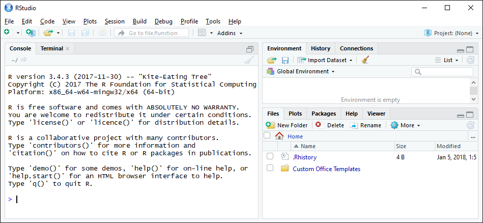
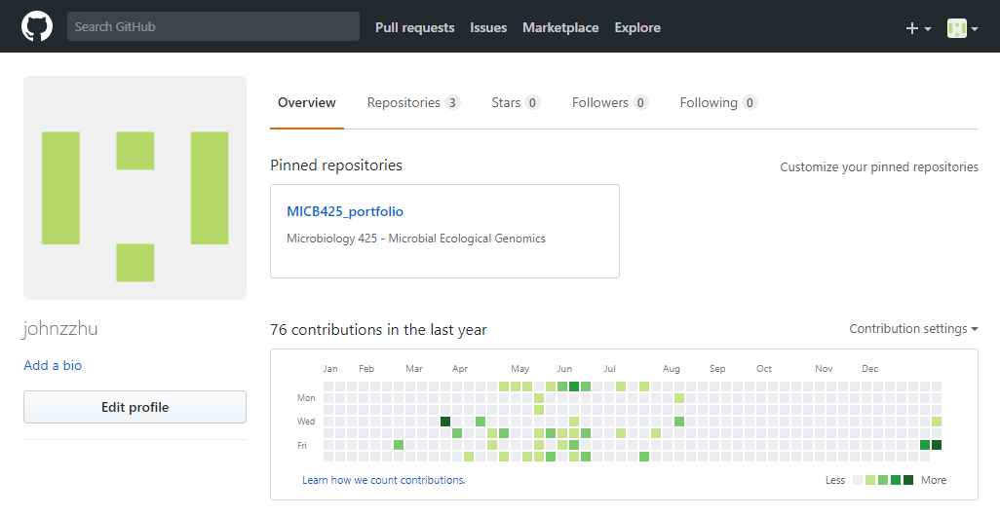

# Module 01

## Module 01 portfolio check
* Installation check
    + Completion status:
    + Comments:
* Portfolio repo setup
    + Completion status: 
    + Comments:
* RMarkdown Pretty PDF Challenge
    + Completion status:
    + Comments:
* Evidence worksheet_01
    + Completion status:
    + Comments:
* Evidence worksheet_02
    + Completion status:
    + Comments:
* Evidence worksheet_03
    + Completion status:
    + Comments:
* Problem Set_01
    + Completion status:
    + Comments:
* Problem Set_02
    + Completion status:
    + Comments:
* Writing assessment_01
    + Completion status:
    + Comments:
* Additional Readings
    + Completion status:
    + Comments  
    
## Data science Friday  

### Installation check




### Portfolio repo setup

*Set up Git user locally*
```
git config --global user.name "johnzzhu"
git config --global user.email $EMAIL
```

*Creating local repository*
```
cd $REPO_DIR
git init
git add .
git commit -m "Initial commit"
git remote add origin $REPO_URL
git remote -v
git push -u origin master
```

### RMarkdown pretty PDF challenge
Paste your code from the in-class activity of recreating the example PDF.


## Origins and Earth Systems
### Evidence worksheet 01
[Whitman *et al* 1998](https://www.ncbi.nlm.nih.gov/pmc/articles/PMC33863/)

#### Learning objectives
Describe the numerical abundance of microbial life in relation to ecology and biogeochemistry of Earth systems. 

#### General questions
* What were the main questions being asked?

    What is the total number, density, carbon mass, growth and turnover rates of prokaryotic organisms in aquatic, soil, and subsurface environments?
    
* What were the primary methodological approaches used?
    
    This study is a review of other published literature. The authors presented data from other studies of aquatic, soil, and subsurface environments, and presented them in a tabular form. The authors then extrapolate the remaining data so that values of cell densities, abundances, and carbon contents are complete for each environment. Lastly the authors conduct comparative analyses based on these data and address these questions.  

* Summarize the main results or findings.  

    * Total prokaryotic carbon on Earth is estimated to be 60~100% of the carbon mass found in plants.
    * Prokaryotes have approx. one order of magnitude more of total N and P mass than that in plants, because they contain much more N and P relative to carbon than plants do.
    * Total protoplasmic biomass on Earth in microbes is far higher than plants
    * Lower limit in prokaryotic turnover time ranges from 6-25 days to ~1000 days (1-2 thousand years for subsurface bacteria, however it is far longer than expected and is based on one sample) 
    * 0.4, 0.5, 3.4, and 170 hours avg for 4 mutations from the pool of all genes shared by marine heterotrophs (in the upper 200 m), marine autotrophs, soil prokaryotes, or prokaryotes in domestic animals
    * 60 years avg for 5 mutations from the pool of all genes shared by all 4 groups  

* Do new questions arise from the results?  

    Why is the subsurface turnover rate so slow?  
    Which hypothesis is true: metabolic inactivity, lithotrophic metabolism, overestimation of subsurface biomass, underestimation of carbon assimilation?  

* Were there any specific challenges or advantages in understanding the paper (*e.g.* did the authors provide sufficient background information to understand experimental logic, were methods explained adequately, were any specific assumptions made, were conclusions justified based on the evidence, were the figures or tables useful and easy to understand)?  

    Could clarify what is “four simultaneous mutations in every gene shared by the populations of marine heterotrophs” a bit more. 


### Problem set 01
#### Learning objectives: 
Describe the numerical abundance of microbial life in relation to the ecology and biogeochemistry of Earth systems.

#### Specific questions:
* What are the primary prokaryotic habitats on Earth and how do they vary with respect to their capacity to support life? Provide a breakdown of total cell abundance for each primary habitat from the tables provided in the text.  

* What is the estimated prokaryotic cell abundance in the upper 200 m of the ocean and what fraction of this biomass is represented by marine cyanobacterium including Prochlorococcus? What is the significance of this ratio with respect to carbon cycling in the ocean and the atmospheric composition of the Earth?  

* What is the difference between an autotroph, heterotroph, and a lithotroph based on information provided in the text?  

* Based on information provided in the text and your knowledge of geography what is the deepest habitat capable of supporting prokaryotic life? What is the primary limiting factor at this depth?  

* Based on information provided in the text your knowledge of geography what is the highest habitat capable of supporting prokaryotic life? What is the primary limiting factor at this height?  

* Based on estimates of prokaryotic habitat limitation, what is the vertical distance of the Earth’s biosphere measured in km?  

* How was annual cellular production of prokaryotes described in Table 7 column four determined? (Provide an example of the calculation)  

* What is the relationship between carbon content, carbon assimilation efficiency and turnover rates in the upper 200m of the ocean? Why does this vary with depth in the ocean and between terrestrial and marine habitats?  

* How were the frequency numbers for four simultaneous mutations in shared genes determined for marine heterotrophs and marine autotrophs given an average mutation rate of 4 x 10^-7^ per DNA replication? (Provide an example of the calculation with units. Hint: cell and generation cancel out)  

* Given the large population size and high mutation rate of prokaryotic cells, what are the implications with respect to genetic diversity and adaptive potential? Are point mutations the only way in which microbial genomes diversify and adapt?  

* What relationships can be inferred between prokaryotic abundance, diversity, and metabolic potential based on the information provided in the text? 


### Module 01 references
Whitman WB, Coleman DC, and Wiebe WJ. 1998. Prokaryotes: The unseen majority. Proc Natl Acad Sci USA. 95(12):6578–6583.  [PMC33863](https://www.ncbi.nlm.nih.gov/pmc/articles/PMC33863/)