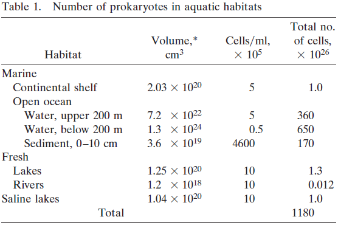
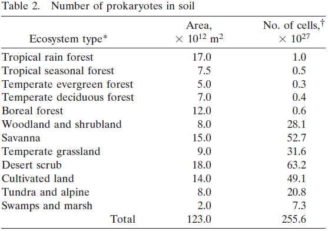
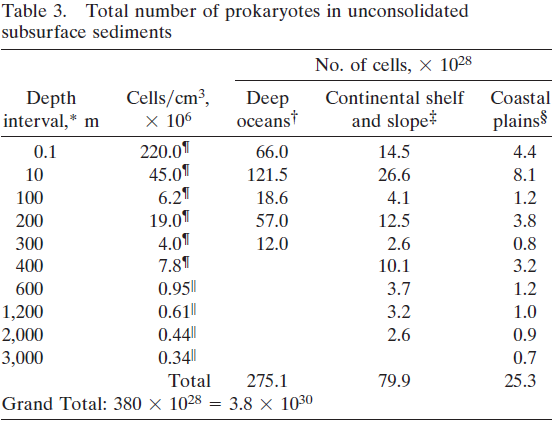

# Module 01

## Data science Friday  

### Installation check


### Portfolio repo setup

*Set up Git user locally*
```
git config --global user.name $USERNAME
git config --global user.email $EMAIL
```

*Creating local repository*
```
cd $REPO_DIR
git init
git add .
git commit -m "Initial commit"
git remote add origin $REPO_URL
git remote -v
git push -u origin master
```

### RMarkdown pretty PDF challenge
````
`r paste(readLines('module_1/pretty_html.Rmd', encoding = "UTF-8"), collapse = '\n')`
````

### Plotting data in R

Installing Phyloseq
``` {r eval=FALSE}
source("https://bioconductor.org/biocLite.R")
biocLite("phyloseq")
```

Load libraries & data
``` {r message=FALSE}
library(tidyverse)
library(phyloseq)
metadata=read.table(file="module_1/Saanich.metadata.txt", header=TRUE, row.names=1, sep="\t", na.strings="NAN")
load("module_1/phyloseq_object.RData")
```

Plot 1: Simple scatterplot
``` {r}
ggplot(metadata, aes(x=PO4_uM, y=Depth_m)) + 
  geom_point(shape=17, color="purple")
```

Plot 2: Plot dplyr mutated data
``` {r}
metadata %>% 
  mutate(Temperature_F = Temperature_C * 9/5 + 32) %>%  # convert C to F
  ggplot(aes(x=Temperature_F, y=Depth_m)) +
  geom_point()
```

Plot 3: Plot using Phyloseq mutated data & adding labels
``` {r}
physeq_percent = transform_sample_counts(physeq, function(x) 100 * x/sum(x)) # transform to relative abundance
plot_bar(physeq_percent, fill="Domain") + 
  geom_bar(aes(fill=Domain), stat="identity") +
  labs(y="Percent Relative Abundance by Domain", x="Sample Depth Below Water Surface (m)", 
       title="Distribution of Domains at Various Sample Depths")
```

Plot 4: Faceted plot using tidied data 
``` {r}
metadata %>% 
  select(Depth_m, NH4_uM, NO2_uM, NO3_uM, O2_uM, PO4_uM, SiO2_uM) %>% 
  gather(Nutrient,uM,-Depth_m) %>% # tidy the data
  ggplot(aes(x=Depth_m, y=uM)) + 
  geom_line() + geom_point() + # line plot with points
  facet_wrap(~Nutrient, scales="free_y") + # facet the plot
  theme(legend.position="none") # remove the legend
```


## Origins and Earth Systems
### Evidence worksheet 01

[Whitman *et al* 1998](https://www.ncbi.nlm.nih.gov/pmc/articles/PMC33863/) *Prokaryotes: The unseen majority*  

#### Learning objectives
Describe the numerical abundance of microbial life in relation to ecology and biogeochemistry of Earth systems. 

#### General questions
* What were the main questions being asked?

    What is the total number, density, carbon mass, growth and turnover rates of prokaryotic organisms in aquatic, soil, and subsurface environments?
    
* What were the primary methodological approaches used?
    
    This study is a review of other published literature. The authors presented data from other studies of aquatic, soil, and subsurface environments, and presented them in a tabular form. The authors then extrapolate the remaining data so that values of cell densities, abundances, and carbon contents are complete for each environment. Lastly the authors conduct comparative analyses based on these data and address these questions.  

* Summarize the main results or findings.  

    * Total prokaryotic carbon on Earth is estimated to be 60~100% of the carbon mass found in plants.
    * Prokaryotes have approx. one order of magnitude more of total N and P mass than that in plants, because they contain much more N and P relative to carbon than plants do.
    * Total protoplasmic biomass on Earth in microbes is far higher than plants
    * Lower limit in prokaryotic turnover time ranges from 6-25 days to ~1000 days (1-2 thousand years for subsurface bacteria, however it is far longer than expected and is based on one sample) 
    * 0.4, 0.5, 3.4, and 170 hours avg for 4 mutations from the pool of all genes shared by marine heterotrophs (in the upper 200 m), marine autotrophs, soil prokaryotes, or prokaryotes in domestic animals
    * 60 years avg for 5 mutations from the pool of all genes shared by all 4 groups    

* Do new questions arise from the results?  

    Why is the subsurface turnover rate so slow?  
    Which hypothesis is true: metabolic inactivity, lithotrophic metabolism, overestimation of subsurface biomass, underestimation of carbon assimilation?  

* Were there any specific challenges or advantages in understanding the paper (*e.g.* did the authors provide sufficient background information to understand experimental logic, were methods explained adequately, were any specific assumptions made, were conclusions justified based on the evidence, were the figures or tables useful and easy to understand)?  

    Could clarify what is “four simultaneous mutations in every gene shared by the populations of marine heterotrophs” a bit more. 


### Problem set 01  

[Whitman *et al* 1998](https://www.ncbi.nlm.nih.gov/pmc/articles/PMC33863/) *Prokaryotes: The unseen majority*  

#### Learning objectives
Describe the numerical abundance of microbial life in relation to the ecology and biogeochemistry of Earth systems.

#### Specific questions
* What are the primary prokaryotic habitats on Earth and how do they vary with respect to their capacity to support life? Provide a breakdown of total cell abundance for each primary habitat from the tables provided in the text.  

    The habitats are **aquatic, soil,** and **subsurface**  
    
    Total cell abundances:  
    
    Aquatic: \(1.181E29\) cells  
    Soil:   \(2.556E29\) cells  
    Subsurface: \(3.8E30\) cells  
    
      
      
      

* What is the estimated prokaryotic cell abundance in the upper 200 m of the ocean and what fraction of this biomass is represented by marine cyanobacterium including Prochlorococcus? What is the significance of this ratio with respect to carbon cycling in the ocean and the atmospheric composition of the Earth?  

    The estimated prokaryotic cell abundance is 5E5 cells/mL, or 360E26 cells total.  
    Marine cyanobacteria & Procholorococcus account for 4E4 of the cells per mL, or 8% of all prokaryotic cells in the top 200m.  
    They are responsible for atmospheric oxygenation and carbon assimilation.

* What is the difference between an autotroph, heterotroph, and a lithotroph based on information provided in the text?   

    Autotroph: Energy source independent of organic substrates  
    Heterotroph: Energy source from organic carbon substrates  
    Lithotroph: Energy source from inorganic substrates  

* Based on information provided in the text and your knowledge of geography what is the deepest habitat capable of supporting prokaryotic life? What is the primary limiting factor at this depth?  
    
    At a subsurface depth of 4km, the average temperature is 125C.  
    This is close to the temperature limit for prokaryotic life.  
    The high temperature is likely due to geothermal processes.  
    On average, the temperature increases by 22 degrees Celsius per km depth.

* Based on information provided in the text your knowledge of geography what is the highest habitat capable of supporting prokaryotic life? What is the primary limiting factor at this height?  

    Prokaryotic life has been detected in the air at very low qualtities up to 57-77km (more likely 20km realistically).  
    The low temperature & pressure as well as extreme solar radiation are limiting factors at this height.  
    However it is arguable that the atmosphere is capable of supporting growth (as opposed to transport) due to the lack of many essential nutrients at any appreciable concentrations.

* Based on estimates of prokaryotic habitat limitation, what is the vertical distance of the Earth’s biosphere measured in km?  

    If including the atmosphere, Earth's biosphere spans from approx. 20km above the summit of Mt. Everest to approx. 4.5km below the Marianas Trench. This amounts to approx. 44km. 

* How was annual cellular production of prokaryotes described in Table 7 column four determined? (Provide an example of the calculation)  

    Annual cellular production is the population size mutiplied by the number of turnover periods in a year.  
    For marine heterotrophs above 200m:  
    Population size = \(3.6E28\) cells  
    Turnover period = \(16\) days  
    Annual cellular production = population * turnover/yr = \(3.6E28\frac{365}{16} = 8.215E29\) cells/yr  
    *Aside*: Viruses play a significant role in driving this turnover. Viruses often carry accesorry metabolism genes (AMG) which directly modulates cellular metabolism. At a larger scale, this in turn modulates the metabolism of the community.

* What is the relationship between carbon content, carbon assimilation efficiency and turnover rates in the upper 200m of the ocean? Why does this vary with depth in the ocean and between terrestrial and marine habitats?  

    A number of assumptions need to be made to establish these relationships.  
    
    Assuming:  
    20fg = 20E-30Pg of C per cell and  
    3.6E28 marine heterophs in the upper 200m  
    We can estimate that there are:  
    3.6E28 * 2E-30 = 0.72Pg C in marine heterotrophs in the upper 200m  
    
    Assuming:  
    20% carbon assimilation efficiency (growth efficiency, substrate use efficiency)  
    We can estimate that amount of C required per turnover to be:  
    4 * 0.72 = 2.88Pg (unclear why the author used a factor of 4 instead of 5)  
    
    Assuming:  
    The net primary production in terms of C is 51Pg/yr and  
    85% of it is consumed in the top 200m, all by prokaryotes  
    We can estimate that the amount of C available per year is:  
    51 * 0.85 = 43Pg/yr  
    
    This works out to 43/2.88 = 14.9 turnovers per year or 24.5 days  

* How were the frequency numbers for four simultaneous mutations in shared genes determined for marine heterotrophs and marine autotrophs given an average mutation rate of 4 x 10^-7^ per DNA replication? (Provide an example of the calculation with units. Hint: cell and generation cancel out)  

    The probability of 4 simultaneous mutations would be (4E-7)^4^ = 2.56E-26 per replication.  
    
    Given the turnover rate to be 8.215E29 cells/yr from a previous question, then there is an average of 8.2E29 * 2.56E-26 = 2.1E4 four simultaneous mutation events per year, or about 0.4 per hour.


* Given the large population size and high mutation rate of prokaryotic cells, what are the implications with respect to genetic diversity and adaptive potential? Are point mutations the only way in which microbial genomes diversify and adapt?  

    The prokaryotic genomes have tremendous abilities to change given high mutation rates, large population size, and rapid turnover rates. By accumulating mutations not only through point mutations but also through insertion, deletion, HGT and recombination, mutations can rapidly spread horizontally and vertically. This makes the world of prokaryotes incredibly diverse and adaptable to any kind of biologically viable habitat.

* What relationships can be inferred between prokaryotic abundance, diversity, and metabolic potential based on the information provided in the text?  
    
    Since there is high diversity, there is also a wide range of metabolic capabilities.  
    Since there is also high abundance, the impact/extent of metabolism on the Earth is also very large - enough to oxygenate the atmosphere, for example.


### Evidence Worksheet 02

[Kasting & Siefert, 2002](https://www.ncbi.nlm.nih.gov/pubmed/12004117) *Life and the evolution of Earth's atmosphere*  

[Nisbet & Sleep, 2001](https://www.nature.com/articles/35059210) *The habitat and nature of early life*  

#### Learning objectives
Comment on the emergence of microbial life and the evolution of Earth systems
    
#### General Questions
* Indicate the key events in the evolution of Earth systems at each approximate moment in the time series. If times need to be adjusted or added to the timeline to fully account for the development of Earth systems, please do so.

* Describe the dominant physical and chemical characteristics of Earth systems at the following waypoints

    + **Hadean**  
      Hot & dry  
      Often molten due to constant bombardment  
      Oceans cannot form  
      CO2 tied up in minerals  
    
        + 4.6 billion years ago  
          Inner solar system formed  
          Water vapour & carbon (as CO2 in limestone) deposited on Earth  
          Hot (500C)

        + 4.5 billion years ago  
          Moon forming impact led to Earth spin, tilt, generated diurnal cycle & seasons
          Rock vapour atmosphere formed (optically thick)
          Hot (~100C) for 2 million years
          Late heavy bombardments - Frequent large scale bombardments raise temp over 100C
      
        + 4.4 billion years ago
          Zircons formed
          
        + 4.1 billion years ago
          Evidence of life found in graphite in Zircons
    
        + 4.0 billion years ago  
          Evidence of plate subduction
          Oldest rock - Acasta gneiss from Canada
      
    + **Archean**  
      Cooldown of Earth  
      Oceans formed
      Early sun is still dim (30% dimmer)  
      Methanogenesis kept Earth from freezing  
      
        + 3.8 billion years ago  
          Bombardments halted  
          Oceans formed  
          Evidence of sedimentary rocks  
          Seawater chemistry stabilized
          Evidence of life in carbon isotopes too
        
        + 3.75 billion years ago  
          Evidence of photosynthesis  
        
        + 3.5 billion years ago  
          Microfossils, stromatolites 
          Evidence of isotopic partition of C from carbonate
          Most likely Rubisco global oxygenic photosynthesis 
        
        + 3.0 billion years ago  
          First glaciation event - oxygen stops methanogensis
        
        + 2.7 billion years ago  
          Evidence of cyanobacteria & eukaryotes

    + **Proterozoic**  
      Oxygeneated atmosphere  
      Increased complexity of life  

        + 2.2 billion years ago  
          Great oxidation event - sharp increase in O2 (may involve complex eukaryotes)  
          Evidence of redbeds containing iron oxide  
          Regulation of mitochondria & chloroplasts may modulate balance of photosynthesis, CO2 & N fixation
        
        + 2.1 billion years ago
          Oxygenic photosynthesis in cyanobacteria
          
        + 1.2 billion years ago
          Evidence of sexual reproduction
      
    + **Phanerozoic**  
      Evolution of higher organisms  
      Several extinction events
      Very high atmospheric oxygenation at one point, correlated to gigantism
         
        + 500 million years ago
          Cambrian explosion
          
        + 400 million years ago
          Devonian explosion - land plants
          Fish, cephalopods, corals formed
          
        + 300 million years ago
          Gigantism
          Formation of Pangae
     
        + 250 million years ago
          Permian extinction
          
        + 240 million years ago
          Evidence of dinosours
          
        + 200 million years ago
          Triassic Jurassic extinction event
          
        + 60 million years ago
          Creataceous Tertiary extinction event
        
        + 550,000 years ago
          Archaic humans first appear
        
        + 200,000 years ago
          Homo sapiens first appear

### Problem set 02

[Falkowski *et al* 2008](https://www.ncbi.nlm.nih.gov/pubmed/18497287) *The microbial engines that drive Earth's biogeochemical cycles*

#### Learning objectives
Discuss the role of microbial diversity and formation of coupled metabolism in driving global biogeochemical cycles.

#### Specific Questions
* What are the primary geophysical and biogeochemical processes that create and sustain conditions for life on Earth? How do abiotic versus biotic processes vary with respect to matter and energy transformation and how are they interconnected?  

    The primary geophysical and biogeochemical processes are plate tectonics & atmospheric photochemical processes. They allow distribution, resupply, and reaction between chemical species & nutrients.

    Abiotic processes are primarily acid-base (H ions), because most of molecular H has escaped to space during Earth's formation, whereas biotic processes are primarily redox (electrons).

* Why is Earth’s redox state considered an emergent property?  

    Since biological processes are largely redox based, and Earth's abiotic processes interacts and ultimately drive the biological processes, Earth's redox state is a property tightly linked to its biosphere, thus it's considered an emergent property.  

* How do reversible electron transfer reactions give rise to element and nutrient cycles at different ecological scales? What strategies do microbes use to overcome thermodynamic barriers to reversible electron flow?  

    Since much of microbial metabolism involves redox reactions of the 6 major elements, the sum of metabolism at the micro scale transforms the plant at the macro scale.  
    Microbes take advantage of Le Chatelier's principle, which can moderate thermodynamic favourability by limiting the relative abundance of reaction products and reactants.  
    Methane oxidizing organisms form mutualistic relationships with hydrogen-consuming sulfate reducers. Through continued consumption of hydrogen, its concentration remains low, making methane oxidization favorable.  
    Similarly, the TCA cycle which oxidizes organic carbon into CO2 is also run in reverse in carbon fixing bacteria such as GSBs.

* Using information provided in the text, describe how the nitrogen cycle partitions between different redox “niches” and microbial groups. Is there a relationship between the nitrogen cycle and climate change?   

    N cycling involves many different redox niches and microbial group.
    Nitrogen fixation is carried out solely anaerobically by nitrogenase.
    Ammonia is oxidized to nitriate or nitrite aerobically by nitrifying bacteria.
    Another reductive process used by yet other microbes anaerobically reduce ntrite and nitrate to dinitrogen.
    Different microbes that run parts of this cycle are often segregated in time and/or space, due to different requirements in reaction conditions.

    N cycling and climate change may be related in that nitrifying bacteria undergo carbon fixation & assimilation by reducing CO2 while oxidizing ammonia, thus reducing atmospheric CO2.

* What is the relationship between microbial diversity and metabolic diversity and how does this relate to the discovery of new protein families from microbial community genomes?  

    Metabolic and microbial diversity are often, but not always correlated. For example, the presence of fundamental metabilic processes does not reflect the actual microbial diversity. Neither do simple pathways such as rhodopsin based photosynthesis.  

* On what basis do the authors consider microbes the guardians of metabolism?  

    Since the "core planetary gene set" which enables the fundamental metabilic processes is widespread in diverse species of microbes, the extinction of even the majority of the species does not necessarily mean the loss of this set. This microbes as a whole are considered as guardians of metabolism.
    
### Evidence worksheet 03

[Waters et al 2016](https://www.ncbi.nlm.nih.gov/pubmed/26744408) *The Anthropocene is functionally and stratigraphically distinct from the Holocene*  

#### Learning objectives
Evaluate human impacts on the ecology and biogeochemistry of Earth systems

#### General questions
* What were the main questions being asked?

    What are some stratigraphic signatures in sediments and ice that reflect human activities which support the designation of the Anthropocene epoch?
    
* What were the primary methodological approaches used?
    
    This article is a review, summarizing findings of primary literature.  
  
* Summarize the main results or findings. 

    Geological evidence showed 
      * Traces of elemental aluminum, concrete, plastics from developlent of modern materials  
      * Traces of carbonaceous particles from fossil fuel burning
      * Increased polyaromatic hydrocarbons, PCBs, pesticide from synthetic chemicals
      * Changed lead isotopic ratios from burning of leaded gasoline
      * Increased rates of sedimentation due to increased erosion
      * Elevated levels of nitrogen and phosphorus in lake strata & Greenland ice
      * Elevated levels of radioisotopes C-14 and Pu-239 due to thermonuclear weapons tests
      * Steep fall in C-13 ratio captured in tree rings, limestones, and calcareous fossils associated with elevated atmospheric CO2 and CH4 starting around 1850-1950
      * Increased temperature, O-18 ratio in Greenland ice, and rising global sea levels beyond Holocene levels
    
    Additionally there is increased rates of extinction and changes in species composition due to human exploitation and species invasion.

* Do new questions arise from the results?  

    Should we formalize the Anthropocene as a stratigraphic entity like other epochs? Should we simply keep it informal like the Precambrian?  
    How should we define the Anthropocene, by GSSA (calendar age), and/or GSSP (stratal section)? When does it formally begin?  

* Were there any specific challenges or advantages in understanding the paper (*e.g.* did the authors provide sufficient background information to understand experimental logic, were methods explained adequately, were any specific assumptions made, were conclusions justified based on the evidence, were the figures or tables useful and easy to understand)?  

    Since the focus of this article is on stratigraphic/geologic evidence, the discussion of species extinction and diversity sounds a bit out of place. But otherwise the discussion was easy to follow.
    
### Module Essay
        
    Microbial life is ubiquitous. Although mostly invisible to the naked eye, they are in fact orders of magnitude more abundant in number than that of visible, higher life forms that we know of. Microbes have also inhabited Earth since the Archean eon (Nisbet & Sleep, 2003). Humans, on the other hand, have only come into existence extremely recently in geological time, inescapably dependent upon the works of the unseen majority (Whitman & Wiebe, 1998). Unsurprisingly, microbial metabolism on Earth then becomes a cornerstone of biological fluxes in practically every major geochemical cycle. Microbes can, and have lived on a planet without humans, but humans would not have existed, nor can we continue to survive, without the global catalysis and environmental transformations carried out by microbes. This is evident in through key fluxes of the global oxygen, nitrogen, and carbon cycles.  
    
    From the perspective of oxygen cycle, microbial life has not only laid the foundation of aerobic respiration, but it also continues to provide a large source of oxygen today. Humans respire aerobically, using molecular oxygen as a terminal electron acceptor (TEA) at the end of cellular electron transport chains (ETC). By deriving electrons from organic carbon sources and relaying them through the ETC, cells transform energy in the form of redox potentials into adenosine triphosphate (ATP), the cellular energy currency. However, the atmosphere was anoxic until 2.2Gya (Nisbet & Sleep, 2003). Moreover, the earliest evidence of Rubisco, which is the key enzyme responsible for oxygenic photosynthesis, was dated at 3.5Gya (Nisbet & Sleep, 2003, Schidlowski & Aharon, 1992). This provides strong evidence that microbial oxygenic photosynthesis initially provided the molecular oxygen required for the development of aerobic respiration carried out by humans today. Additionally, microbial generation of oxygen continues to contribute substantially to the global oxygen supply. Oxygenic photosynthesis in oceanic ecosystems is approximately on-par with terrestrial ecosystems in terms of total flux (Walker et al. 1980). Therefore microbial metabolism contributes to approximately half of global oxygen output. If global microbial life had not existed, or was to suddenly be halted, atmospheric oxygen concentration would not remain at levels necessarily to support human life. Microbial sources of oxygen has not only once played, but also continues to play, a crucial role in human survival.  
    
    From the perspective of the nitrogen cycle, we rely on microbes for a balanced cycle necessary to sustain current ecosystems. In order to make us independent of global microbial catalysis, we must artificially replace microbial geochemical fluxes, which means developing an industrial process with sufficient scale. This implies both ubiquity and volume. Consider nitrification for instance. Nitrifying bacteria is pervasive, converting soil ammonia to nitrates, which is a source of preferred nitrogen by some plants due to its higher diffusion rates compared to ammonia (Raven et al. 1992). If all microbial metabolism were to halt, we cannot yet carry out nitrification at a scale pervasive enough to resupply every ecosystem with the nitrates currently supplied by microbes. Additionally, while chemically possible, we do not have the technology to perform abiological nitrification with a significant flux to effectively contribute to the global nitrogen cycle. In fact, we commonly rely on microbial metabolism for large scale nitrification, such as waste water treatment. Lack of microbial nitrification may lead to depletion of soil nitrates, in turn disrupting global flora diversity. Furthermore, even if abiological processes with significant rates exist, as exemplified by the nitrogen fixing Haber-Bosch process, we would still be faced with difficulties in integrating it amongst other fluxes to  maintain the balance. The primary use of industrially fixed nitrogen, in the form of ammonia, is a nitrogen source for fertilizers. Their use often results in eutrophication of nearby still waters due to nitrogen-containing effluent (Callisto et al. 2013). Therefore microbial metabolic fluxes in the nitrogen cycle is irreplaceable due to the sheer ubiquity, volume, and the intricacy of flux balance required to maintain current global ecosystems.  
    
    Perhaps most significantly, from the perspective of the carbon cycle, humans rely on microbial life to respire a large portion of organic carbon. As heterotrophs, we gain energy by oxidizing organic carbon to inorganic carbon dioxide. Therefore we must depend on a continuous source of organic carbon, which ultimately originates from plant primary production. Microbial metabolism plays a critical factor in replenishing atmospheric carbon by decomposing and respiring biomass. It is estimated that microbial metabolism accounts for approximately half of all terrestrial biological soil respiration, or approximately 51-60 Pg/yr of carbon (Hashimoto et al., 2015; Shao et al, 2013). Microbes also carry out virtually all biological respiration in the open oceans, at approximately 66 Pg/yr of carbon (del Giorgio & Duarte 2002). Without global microbial decomposition, biomass will likely accumulate, and humans will not be able to decompose biomass at a global scale. This limits the global replenishment of carbon dioxide, ultimately reducing primary productivity. Thus we rely on the microbial power to catalyze global biomass decay.  
    
    Microbial life can easily live without us; we, however, cannot survive without the global catalysis and environmental transformations it provides. This is exemplified through some of the key roles of microbial metabolism within 3 major biogeochemical cycles. Microbial metabolism oxygenated the atmosphere, enabling aerobic respiration. Microbial metabolism nitrifies reduced nitrogen species pervasively and with globally significant flux, as well as denitrifies while maintaining ecosystem balance. Microbial metabolism also replenishes atmospheric carbon by respiring biomass, thereby making carbon available to for primary production. While microbes can, and have, persisted without the presence of humans, our existence must be supported by the continuous nutrient flux driven by microbial metabolism. We may think that humans are at the helm of Space Ship Earth (Achenbach, 2012). However it is crucial to realize that the Ship is powered by microbes, without which neither we, nor most other higher life forms, can survive. If all microbial metabolism were to suddenly halt, Earth will seemingly come under the grasp of an invisible disease, which may see all remaining life on Earth slowly grind to a halt, as all usable forms of nutrients cease to exist.
        
## References
1. Achenbach J. Spaceship Earth: a new view of environmentalism. Washington Post [Internet]. 2012 Jan 2.  
2. Callisto M, Molozzi J, Barbosa JLE. Eutrophicaion of lakes. In: Ansari AA, Gill SS. Eutrophication: causes, consequences, and control. Dordrecht: Springer; 2013.  
3. Del giorgio PA, Duarte CM. Respiration in the open ocean. Nature. 2002;420(6914):379-84.  
4. Falkowski PG, Fenchel T, Delong EF. The microbial engines that drive Earth's biogeochemical cycles. Science. 2008;320(5879):1034-9.  
5. Hashimoto S, Carvalhais N, Ito A, Migliavacca M, Nishina, Reichstein M. Global spatiotemporal distribution of soil respiration modeled
6. Kasting JF, Siefert JL. Life and the evolution of Earth's atmosphere. Science. 2002;296(5570):1066-8.  
7. Nisbet EG, Sleep NH. The habitat and nature of early life. Nature. 2001;409(6823):1083-91.  
8. Raven JA, Wollenweber B, Handley LL. A comparison of ammonium and nitrate as nitrogen sources for photolithotrophs. New Phytologist. 1992;121:19–32. doi: 10.1111/j.1469-8137.1992.tb01088.x  
9. Schidlowski M, Aharon P. Carbon cycle and carbon isotope record: geochemical impact of life over 3.8 Ga of Earth history. In: Schidlowski M, Golubic S, Kimberley M, McKirdy D, Trudinger PA, editors. Early organic evolution: implications for mineral and energy resources. 1st ed. Berlin: Springer-Verlag; 1992; 147-75.  
10. Shao P, Zeng X, Moore DJP, Zeng X. Soil microbial respiration from observations and Earth system models. Environ Res Lett. 2013;8:034034.
using a global database. Biogeosciences. 2015;12:4121-32.  
11. Walker JCG. The oxygen cycle. In: Hutzinger O. The Natural Environment and the Biogeochemical Cycles. Berlin: Springer-Verlag; 1980.  
12. Waters CN, Zalasiewicz J, Summerhayes C, et al. The Anthropocene is functionally and stratigraphically distinct from the Holocene. Science. 2016;351(6269):aad2622.  
13. Whitman WB, Coleman DC, and Wiebe WJ. Prokaryotes: The unseen majority. Proc Natl Acad Sci USA. 1998;95(12):6578–6583.  


