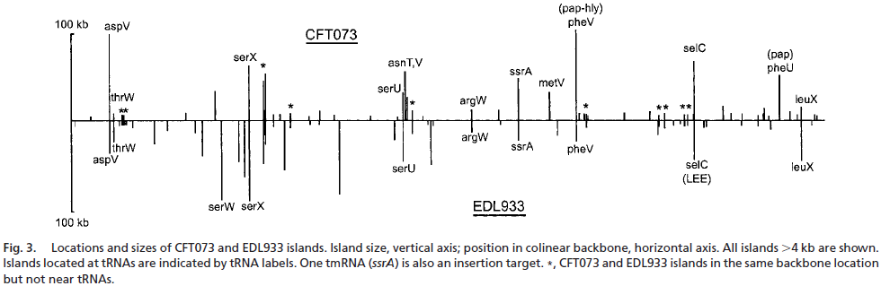

# Module 03
## Microbial Species Concepts
### Problem set 04 "Fine-scale phylogenetic architecture"

#### Learning objectives: 
* Gain experience estimating diversity within a hypothetical microbial community

#### Part 1: Description and enumeration
Obtain a collection of "microbial" cells from "seawater". The cells were concentrated from different depth intervals by a marine microbiologist travelling along the Line-P transect in the northeast subarctic Pacific Ocean off the coast of Vancouver Island British Columbia. 

Sort out and identify different microbial "species" based on shared properties or traits. Record your data in this Rmarkdown using the example data as a guide.

Once you have defined your binning criteria, separate the cells using the sampling bags provided. These operational taxonomic units (OTUs) will be considered separate "species". This problem set is based on content available at [What is Biodiversity](http://cnx.org/content/m12179/latest/).

For example, load in the packages you will use.
```{r message=FALSE}
#To make tables
library(kableExtra)
library(knitr)
#To manipulate and plot data
library(tidyverse)
```

Then load in the data. You should use a similar format to record your community data.
```{r}
community_data = data.frame(
  number = c(1,2,3,4,5,6,7,8,9,10,11,12,13,14),
  name = c("Gummy Bear","Brick","Jube Jube","Kisses","M&M","Mike & Ike","Skittles","Sour Bear","Sour Bottle","Sour Fruit","Sour Octopus","Sour Swirl","Vine","Wine Gum"),
  characteristics = c("Clear/Green/Yellow/Orange/Light red/Dark red","Large/small, Yellow/Green/Blue/Red","Green, Orange, Red, Yellow, Purple","Silver","Blue/Brown/Yellow/Orange/Green/Red","Green/Light red/Dark red/Yellow/Orange","Green/Purple/Orange/Red/Yellow","Red/Yellow/Blue","2 colours per piece","Watermelon/Berry","Blue head, 2 tentacle colours per piece","Blue/Red","Red","Various wine flavours"),
  occurrences = c(101,18,24,16,241,174,187,3,3,2,6,3,14,9)
)
```

Finally, use these data to create a table.
```{r}
community_data %>% 
  kable("html") %>%
  kable_styling(bootstrap_options = "striped", font_size = 10, full_width = F)
```
	
For your sample:

* Construct a table listing each species, its distinguishing characteristics, the name you have given it, and the number of occurrences of the species in the collection.
* Ask yourself if your collection of microbial cells from seawater represents the actual diversity of microorganisms inhabiting waters along the Line-P transect. Were the majority of different species sampled or were many missed? 
 
#### Part 2: Collector's curve
To help answer the questions raised in Part 1, you will conduct a simple but informative analysis that is a standard practice in biodiversity surveys. This analysis involves constructing a collector's curve that plots the cumulative number of species observed along the y-axis and the cumulative number of individuals classified along the x-axis. This curve is an increasing function with a slope that will decrease as more individuals are classified and as fewer species remain to be identified. If sampling stops while the curve is still rapidly increasing then this indicates that sampling is incomplete and many species remain undetected. Alternatively, if the slope of the curve reaches zero (flattens out), sampling is likely more than adequate.

To construct the curve for your samples, choose a cell within the collection at random. This will be your first data point, such that X = 1 and Y = 1. Next, move consistently in any direction to a new cell and record whether it is different from the first. In this step X = 2, but Y may remain 1 or change to 2 if the individual represents a new species. Repeat this process until you have proceeded through all cells in your collection.

For example, we load in these data.
```{r}
collectors_curve_data = data.frame(
  x = c(1,2,3,4,5,6,7,8,9,10,11,12,13,14,15,16,17,18,19,20,21,22,23,24,25,26,27,28,29,30,31,32,33,34,35,36,37,38,39,40,41,42,43,44,45,46,47,48,49,50,51,52,53,54,55,56,57,58,59,60,61,62,63,64,65,66,67,68,69,70,71,72,73,74,75,76,77,78,79,80,81,82,83,84,85,86,87,88,89,90,91,92,93,94,95,96,97,98,99,100,101,102,103,104,105,106,107),
  y = c(1,2,3,3,3,3,4,5,6,6,6,7,7,7,7,7,7,7,7,7,7,7,7,7,7,7,8,9,10,10,10,10,10,10,10,10,10,11,11,11,11,11,11,11,11,11,11,11,11,11,11,11,11,11,11,11,11,11,11,11,11,11,11,11,11,11,11,11,11,11,11,11,11,11,11,11,11,11,11,11,11,11,11,11,11,11,11,11,11,11,11,11,11,11,11,11,11,11,11,11,11,11,11,11,11,11,11)
)
```

And then create a plot. We will use a scatterplot (geom_point) to plot the raw data and then add a smoother to see the overall trend of the data.
```{r}
ggplot(collectors_curve_data, aes(x=x, y=y)) +
  geom_point() +
  geom_smooth() +
  labs(x="Cumulative number of individuals classified", y="Cumulative number of species observed")
```

For your sample:

* Create a collector's curve.
* Does the curve flatten out? If so, after how many individual cells have been collected?

    The curve flattens out after approx. 50 individuals.
    
* What can you conclude from the shape of your collector's curve as to your depth of sampling?

    The sampling is adequate because the the curve is flat when all of the individuals are counted.

#### Part 3: Diversity estimates (alpha diversity)
Using the table from Part 1, calculate species diversity using the following indices or metrics.

##### Diversity: Simpson Reciprocal Index

$\frac{1}{D}$ where $D = \sum p_i^2$

$p_i$ = the fractional abundance of the $i^{th}$ species

For example, using the example data 1 with 3 species with 2, 4, and 1 individuals each, D =

```{r}
species1 = 2/(2+4+1)
species2 = 4/(2+4+1)
species3 = 1/(2+4+1)

1 / (species1^2 + species2^2 + species3^2)
```

The higher the value is, the greater the diversity. The maximum value is the number of species in the sample, which occurs when all species contain an equal number of individuals. Because the index reflects the number of species present (richness) and the relative proportions of each species with a community (evenness), this metric is a diveristy metric. Consider that a community can have the same number of species (equal richness) but manifest a skewed distribution in the proportion of each species (unequal evenness), which would result in different diveristy values.

* What is the Simpson Reciprocal Index for your sample?

``` {r}
simpson_D = 0
community_count = sum(community_data$occurrences)
for (i in 1:length(community_data$number)) {
  simpson_D = simpson_D + (community_data$occurrences[i] / community_count) ^ 2
}
1 / simpson_D
```

##### Richness: Chao1 richness estimator
Another way to calculate diversity is to estimate the number of species that are present in a sample based on the empirical data to give an upper boundary of the richness of a sample. Here, we use the Chao1 richness estimator. 

$S_{chao1} = S_{obs} + \frac{a^2}{2b})$

$S_{obs}$ = total number of species observed
a = species observed once
b = species observed twice or more

So for our previous example community of 3 species with 2, 4, and 1 individuals each, $S_{chao1}$ =

```{r}
3 + 1^2/(2*2)
```

* What is the chao1 estimate for your sample?

``` {r}
community_species_count = length(community_data$number)
observed_once = 0
observed_multiple_times = 0
for (i in 1:length(community_data$number)) {
  if (community_data$occurrences[i] == 1) {
    observed_once = observed_once + 1
  } else {
    observed_multiple_times = observed_multiple_times + 1
  }
}
community_species_count + (observed_once ^ 2) / (2 * observed_multiple_times)
```


#### Part 4: Alpha-diversity functions in R
We've been doing the above calculations by hand, which is a very good exercise to aid in understanding the math behind these estimates. Not surprisingly, these same calculations can be done with R functions. Since we just have a species table, we will use the `vegan` package. You will need to install this package if you have not done so previously. 

```{r message=FALSE}
library(vegan)
```

First, we must remove the unnecesary data columns and transpose the data so that `vegan` reads it as a species table with species as columns and rows as samples (of which you only have 1).
```{r}
community_data_diversity = 
  community_data %>% 
  select(name, occurrences) %>% 
  spread(name, occurrences)

community_data_diversity
```

Then we can calculate the Simpson Reciprocal Index using the `diversity` function.
```{r}
diversity(community_data_diversity, index="invsimpson")
```

And we can calculate the Chao1 richness estimator (and others by default) with the the `specpool` function for extrapolated species richness. This function rounds to the nearest whole number so the value will be slightly different that what you've calculated above.
```{r}
specpool(community_data_diversity)
```

In Project 1, you will also see functions for calculating alpha-diversity in the `phyloseq` package since we will be working with data in that form.

For your sample:

* What is the Simpson Reciprocal Index using the R function?  

    See above code blocks  
    
* What is the chao1 estimate using the R function?
    + Verify that these values match your previous calculations.  
    
    See above code blocks. Previous calculations were accurate.

#### Part 5: Concluding activity
If you are stuck on some of these final questions, reading the [Kunin et al. 2010](https://www.ncbi.nlm.nih.gov/pubmed/19725865) and [Lundin et al. 2012](https://www.ncbi.nlm.nih.gov/pubmed/23760801) papers may provide helpful insights. 

* How does the measure of diversity depend on the definition of species in your samples?

    If the definition of species is more granular, the diversity measures increase, since we observe more differences in the same sample.

* Can you think of alternative ways to cluster or bin your data that might change the observed number of species?

    For our candy sample, we could have included differences in colour which would have increased our species count. Conversely we could have collapsed all chocolate candies and decreased our species count. For microbial species, we could lower the percent similarity threshold to reduce species counts. We could also consider other aspects like metabolic function, physical characteristics, habitat, etc.
    
* How might different sequencing technologies influence observed diversity in a sample?  

    Sequencing technologies vary in their error rate and assembly characteristics. This could result in errornous binning and thus influence the species diversity.

* Rules of thumb for consistent data  

    1. Consistent sampling method
    2. Consistent & clear species definition
    3. Comparing same gene region using the same primer
    4. Using curated databases
    5. Consistent analysis/processing method
    
    
### Evidence Worksheet 05

[Welch et al 2002](https://www.ncbi.nlm.nih.gov/pubmed/12471157) *Extensive mosaic structure revealed by the complete genome sequence of uropathogenic Escherichia coli*  

#### Part 1: Learning objectives
Evaluate the concept of microbial species based on environmental surveys and cultivation studies.  
Explain the relationship between microdiversity, genomic diversity and metabolic potential  

Comment on the forces mediating divergence and cohesion in natural microbial communities

#### Part 1: General questions
* What were the main questions being asked?  

    What are the genomic differences in CFT073 with respect to other strains of E coli, pathogenic (EDL933) or non-pathogenic (MG1655), that contribute to its pathogenicity?  

* What were the primary methodological approaches used?  

    Strains are isolated and sequenced by dye-termination methods.  
    Sequences were assembled SEQMANII, and annoted using MAGPIE, which used GLIMMER to define ORFs. Predicted proteins were searched on BLAST.  
    Gene orthology was between an CFT073 gene and another EDL933/MG1655 gene if similarity was > 90%, > 90% of both genes was aligned, and the EDL933/MG1655 gene was not matched elsewhere.  
    Codon usage analysis was performed between backbone and pathogenicity island regions.  

* Summarize the main results or findings.  

    Only 39.7% of combined set of proteins were common to all 3 strains.  
    CFT073 lacks type III secretion or some toxin genes that are found in other pathogenic E. coli, but is rich in genes for fimbrial adhesins, autotransporters, iron-sequestration systems, and phase-switch recombinases, which contribute to resistance to flushing & pathogenesis in the urinary tract.
    Although the location relative to the common backbone of many pathogenicity islands were similar between CFT037 and EDL933, their contents varied greatly.

* Do new questions arise from the results?  

    How should the micorbial definition of species change to take into account the frequent gain and loss of genomic sequences, which is heavily environmentally dependent?  
    Further analysis could be conducted on each sufficiently large island to uncover their contents and how they contribute to uropathogenicity.
    With modern day technology, we could also expand the comparison to other strains using more multiplexed methods.

* Were there any specific challenges or advantages in understanding the paper (e.g. did the authors provide sufficient background information to understand experimental logic, were methods explained adequately, were any specific assumptions made, were conclusions justified based on the evidence, were the figures or tables useful and easy to understand)? 

    Although the figures were clear, I think the article would still benefit on representing more text with more figures. The results still seemed text-heavy.

#### Part 2: Learning objectives
Comment on the creative tension between gene loss, duplication and acquisition as it relates to microbial genome evolution  

Identify common molecular signatures used to infer genomic identity and cohesion  

Differentiate between mobile elements and different modes of gene transfer  

#### Part 2: Specific questions
* Based on your reading and discussion notes, explain the meaning and content of the following figure derived from the comparative genomic analysis of three E. coli genomes by Welch et al. Remember that CFT073 is a uropathogenic strain and that EDL933 is an enterohemorrhagic strain. Explain how this study relates to your understanding of ecotype diversity. Provide a definition of ecotype in the context of the human body. Explain why certain subsets of genes in CFT073 provide adaptive traits under your ecological model and speculate on their mode of vertical descent or gene transfer.


    The figure plots the size of pathogenicity islands of 2 strains against their relative positions on the shared backbone. Islands located at tRNA genes are labelled as well.  
    Since an ecotype is defined as a distinct type of organism occupying in a specific environment, and that a human body contains diverse unique enviromnents provided by different organs and bodily locations, there is a high diversity in the ecotypes of microbes who are adapted to live in each environment on the body.  
    To adapt to diverse environments, there must be specifc accessory genes. This is exemplified by the special adhesins present in CFT073 which enables it to resist urinary tract flushing.  
    Accessory genes are usually transferred horizontally which enables rapid development in pathogenicity and are subsequently vertically transmitted. The core set of essential genes, on the other hand, are usually only vertically transmitted during division.  
    
### Module Essay

*Discuss the challenges involved in defining a microbial species and how HGT complicates matters, especially in the context of the evolution and phylogenetic distribution of microbial metabolic pathways.  Can you comment on how HGT influences the maintenance of global biogeochemical cycles through time?  Finally, do you think it is necessary to have a clear definition of a microbial species?  Why or why not?*

The study of microbiology rests upon the ability to categorize concepts using informative and accepted definitions. Surprisingly however, the definition of microbial species remains to be refined. In relatively recent time, with the advent of next-generation genome sequencing technologies, it was gradually realized that the current working species definition is growing inadequate, evident through large intra-species diversity (Konstantinidis et al., 2006). This is in part due to horizontal gene transfer (HGT), a process by which genetic material is transferred and incorporated between two organisms by a mechanism other than reproduction. Rapid evolution facilitated by HGT contributes to the high observed intra-species diversity (Wiedenback et al., 2011). Phylogenetic distribution of metabolic pathways by HGT (Iwasaki & Takagi, 2009) may also contribute to intra-species diversity. In the interest of maintaining a clear species definition while taking into account the observed diversity, there may need to be a compromise between the traditional vertical information flow based classification system, and a novel system that models horizontal information flow.  

**Issues of current microbial species definitions**  
The current microbial species definition is not without problems. Since the long-accepted species definition applies only to sexually reproducing organisms, this definition was adapted to asexually reproducing microbes. Since one of the bases of sexual reproduction was genetic similarity, the working definition for microbes incorporated such a notion. Two microbial genomes are said to belong to the same species if there is at least 70% DNA-DNA hybridization (DDH; Wayne, 1988), which correlates to approximately 97% 16S rRNA gene sequence similarity (Stackebrandt & Goebel, 1994). However in practice, there is great intra-species genotypic and phenotypic diversity (Konstantinidis et al., 2006). This finding may not come as a surprise as the 70% DDH criterium, when applied to mammals, would place humans together with chimpanzees and lemurs (98.4% & 78% DDH; Sibley & Ahlquist, 1987; Sibley et al., 1990). E. coli ecotypes MG1655 (non-pathogenic), CFT073 (uropathogenic), and EDL933 (enterohemorrhagic) were only found to share, by all, 39.2% of their combined set of genes (Welch et al., 2002). This raised to 51.1% for genes that were simply shared by any 2 strains. Consequently, the high intra-species diversity complicates phylogenetic analyses, and limits the information content of a species classification. The challenge therefore lies in increasing the information content of the microbial species definition while consistently representing the diverse set of observed features.  

**Intra-species diversity facilitated by HGT**  
Natural selection is constantly at play in the survival of any organism. Organisms are expected to exploit every means possible. Consequently, they must rapidly adapt to their niches, which are diverse and often dynamic. Compared to vertical transmission of genes as a means of adaptation, HGT is orders of magnitude more frequent. This is readily seen in the development of antibiotic resistance, in which bacterial strains often acquire entire operons on a plasmid in a single event (Davies & Davies, 2010). Pairwise comparisons of genomes sequenced from 8 isolates of Acinetobacter baumanni from a single Mexican tertiary care center revealed a median of 296 gene differences, but only a median of 1.5 de novo mutations (Graña-Miraglia et al., 2017). Similarly, genomic islands, which are clusters of genes introduced via HGT, also confer adaptive advantages. Approximately 25% of CFT073’s genome belonged to genomic islands, enabling its uropathogenicity (Welch et al., 2002). Since bacterial diversification and evolution due to selection pressures is at least in part facilitated by HGT (Wiedenback et al., 2011), HGT therefore may also be responsible for intra-species diversity by transferring accessory genes peripheral to the central genomic backbone (Pál et al. 2005). The resulting diversity and rapid rate diversification complicates the improvement of microbial species definition.  

**Phylogenetic distribution of metabolic pathways facilitated by HGT**  
In addition to rapid adaptation, organisms must also contend with the sheer diversity of niches. The human body alone offers an abundance of diverse environments, from the dry epidermal surface, to the wet genitourinary mucosa, to the acidic gastrointestinal lumen. With diverse environments comes an even greater variety of niches and the need to adapt, evident through the variety of E. coli strains specific for different human environments (Welch et al., 2002). HGT in this regard has also been considered as an efficient mechanism for incorporating novel biological pathways (Pál et al. 2005, Iwasaki & Takagi, 2009). Since one or more genes advantageous for a niche can be picked up and incorporated, HGT is often suggested as an explanation of pervasive phylogenetic presence of homologous metabolic genes, such as those belonging to the denitrification pathway (Jones et al., 2008). Additionally, HGT allows for streamlined metabolic pathway sharing between symbionts, which is observed in the endosymbiotic relationship between mealybugs and 2 bacterial species (Husnik et al., 2013). The role of HGT in providing efficient metabolism is also seen in the maintenance of global biogeochemical pathways throughout time. As HGT may be an explanation of phylogenetic distribution of homologous metabolic genes, it may be that microbes act as “guardians of metabolism” (Falkowski et al., 2008) by maintaining a pervasive, accessible, and extensive library of metabolic genes, ready to be laterally transferred to another microbe. Given the vast variety of metabolic niches, it is unlikely that any gene would become extinct. Thus HGT may be a key factor in functionally maintaining global biogeochemical cycles by acting as a mechanism to mobilize genes along the phylogenetic tree of life, all the while contributing to the already great intra-species diversity.  

**Necessity for a clear microbial species definition**  
Even faced with a multitude of challenges, it is nonetheless worthwhile to clearly define a microbial species. Human understanding, and consequently communication, rests heavily on our ability to consistently label ideas and observations. Development of a tractable and consistent definition while addressing the intra-species microbial diversity will be beneficial not only for the study of microbiology moving forward, but also for its application in fields such as medicine and biotechnology. It may be the case that current ideals for such a definition is too ambitious, as they concern with the integration of intra-species genotypic and phenotypic diversity in an inherently hierarchical model based on vertical information flow. Since the central conserved genomic backbone is vertically transmitted (Pál et al. 2005), while the peripheral accessory genes are often horizontally transferred, it may be viable to consider a bipartite microbial classification model consisting of a novel phenotypic classification in addition to the traditional phylogenetic classification. A phenotypic and/or functional classification system, which have greater information content at lower taxonomic classifications, may very well complement such a deficit observed in the current phylogeny based systems. Since HGT transcends traditional phylogenetic representations, addressing phenotypic diversity independent from phylogeny redirects the focus from vertical information flow, which is inapplicable to HGT, to a more practically applicable descriptor. Thus a bipartite genotypic-phenotypic classification model may reconcile the current microbial species framework with the observed intra-species diversity.  

**Conclusion**  
The exact definition of microbial species has long been a debated topic. The current framework grows inadequate as we begin to observe greater intra-species genotypic and phenotypic diversity. It may be the case that selection pressure drives rapid evolution and diversification which is facilitated by HGT. HGT also contributes to intra-species diversity by enabling the distribution of homologous metabolic genes. As HGT is an integral part of the microbial existence, we must ensure a clear species and sub-species classification framework which is compatible with lateral information flow. A bipartite genotypic-phenotypic framework may present as a solution to this conundrum in order to accurately and consistently describe the wonderful diversity of the microbial world.  

## References
1. Callahan BJ, Mcmurdie PJ, Holmes SP. Exact sequence variants should replace operational taxonomic units in marker-gene data analysis. ISME J. 2017;11(12):2639-2643.
2. Davies J, Davies D. Origins and evolution of antibiotic resistance. Microbiol Mol Biol Rev. 2010;74(3):417-33.
3. Falkowski PG, Fenchel T, Delong EF. The microbial engines that drive Earth's biogeochemical cycles. Science. 2008;320(5879):1034-9.
4. Graña-miraglia L, Lozano LF, Velázquez C, et al. Rapid Gene Turnover as a Significant Source of Genetic Variation in a Recently Seeded Population of a Healthcare-Associated Pathogen. Front Microbiol. 2017;8:1817.
5. Hallam SJ, Torres-beltrán M, Hawley AK. Monitoring microbial responses to ocean deoxygenation in a model oxygen minimum zone. Sci Data. 2017;4:170158.
6. Hawley AK, Torres-beltrán M, Zaikova E, et al. A compendium of multi-omic sequence information from the Saanich Inlet water column. Sci Data. 2017;4:170160.
7. Husnik F, Nikoh N, Koga R, et al. Horizontal gene transfer from diverse bacteria to an insect genome enables a tripartite nested mealybug symbiosis. Cell. 2013;153(7):1567-78.
8. Iwasaki W, Takagi T. Rapid pathway evolution facilitated by horizontal gene transfers across prokaryotic lineages. PLoS Genet. 2009;5(3):e1000402.
9. Jones CM, Stres B, Rosenquist M, Hallin S. Phylogenetic analysis of nitrite, nitric oxide, and nitrous oxide respiratory enzymes reveal a complex evolutionary history for denitrification. Mol Biol Evol. 2008;25(9):1955-66.
10. Konstantinidis KT, Ramette A, Tiedje JM. The bacterial species definition in the genomic era. Philos Trans R Soc Lond, B, Biol Sci. 2006;361(1475):1929-40.
11. Kunin V, Engelbrektson A, Ochman H, Hugenholtz P. Wrinkles in the rare biosphere: pyrosequencing errors can lead to artificial inflation of diversity estimates. Environ Microbiol. 2010;12(1):118-23.
12. Lundin D, Severin I, Logue JB, Ostman O, Andersson AF, Lindström ES. Which sequencing depth is sufficient to describe patterns in bacterial α- and β-diversity?. Environ Microbiol Rep. 2012;4(3):367-72.
13. Pál C, Papp B, Lercher MJ. Adaptive evolution of bacterial metabolic networks by horizontal gene transfer. Nat Genet. 2005;37(12):1372-5.
14. Sibley CG, Ahlquist JE: DNA hybridization evidence of hominoid phylogeny: results from an expanded data set. J Mol Evol. 1987;26:99-121. 
15. Sibley CG, Comstock JA, Ahlquist JE: DNA hybridization evidence of hominoid phylogeny: a reanalysis of the data. J Mol Evol. 1990;30:202-36.
16. Sogin ML, Morrison HG, Huber JA, et al. Microbial diversity in the deep sea and the underexplored "rare biosphere". Proc Natl Acad Sci USA. 2006;103(32):12115-20.
17. Stackebrandt E, Goebel BM. Taxonomic note: a place for DNA-DNA reassociation and 16S rRNA sequence analysis in the present species definition in bacteriology. Int J Syst Evol Micr. 1994;44(4):846-9.
18. Torres-beltrán M, Hawley AK, Capelle D, et al. A compendium of geochemical information from the Saanich Inlet water column. Sci Data. 2017;4:170159.
19. Wayne LG. International Committee on Systematic Bacteriology: announcement of the report of the ad hoc Committee on Reconciliation of Approaches to Bacterial Systematics. Zentralbl Bakteriol Mikrobiol Hyg A. 1988;268(4):433-4.
20. Welch RA, Burland V, Plunkett G, et al. Extensive mosaic structure revealed by the complete genome sequence of uropathogenic Escherichia coli. Proc Natl Acad Sci USA. 2002;99(26):17020-4.
21. Wiedenbeck J, Cohan FM. Origins of bacterial diversity through horizontal genetic transfer and adaptation to new ecological niches. FEMS Microbiol Rev. 2011;35(5):957-76.

